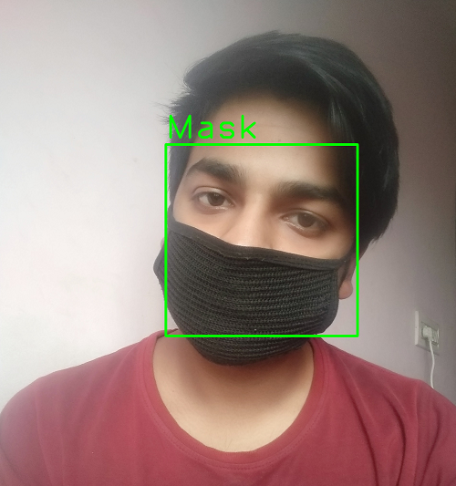

# Covid-19-Face-Mask-Dectector-with-Opencv-deep-learning
Face Mask detector for covid-19( wuhan virus, chinese virus) with opencv, deep learning

# Dependencies

- Tensorflow
- keras
- OPencv
- Dlib
- Imutils

# Testing
- Clone this repository
- Download the weights from https://drive.google.com/file/d/1W3BxofAORs2fIkKTDv6nTpdvUB9IFgEr/view?usp=sharing 
- Execute jupyter notebook ```python test.py --image t1.jpg``` 

# Result


